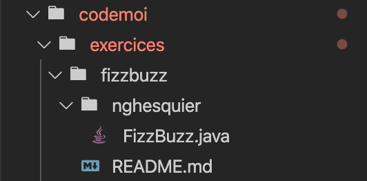

# Code Moi Si Tu Peux
Repo pour poster vos réponses aux exercices présentés en vidéos

Faire des exercices de programmation est le meilleur moyen pour devenir un bon codeur.
Alors je vous propose des exercices sous forme de petites histoires pour vous entrainer.

Il y aura des exercices plus ou moins dures et certains exercices sont séparés en plusieurs niveaux pour que les plus débutants puissent s'y essayer et que les plus avancés y trouve un petit challenge.

Chaque dossier correspond aà un exercice et vous y trouverais un ficher README qui contient l'énoncé.

Pour participer a un exercice, clonez ce repo, créez un nouveau dossier dans cet exercice et nommez le avec votre pseudo et mettez votre solution à l'interieur de celui-ci. Vous pouvez regarder ma solution à l'exercice FizzBuzz.



Quand vous êtes satisfait par votre programme, créez une nouvelle branch, de préference en la nommant:

``` git checkout -b nomexo-monPseudo ```

Faites un push vers ce repo et créez une merge-request. 
Une fois acceptée votre réponse fera partie du repo et sera prise en compte pour le classement!

Ce projet est à l'origine déstiné à des programmeur plutôt débutant qui veulent devenir meilleurs mais ne savent pas comment s'entraîner, mais j'essairais de créer des exercies pour tout les niveaux.

Regardez les solutions des autres, commentés vos préférées, ou donnez des conseils sur les solutions des plus novices. Mais toujours dans la courtoisie bien sûr :)

Mais surtout amusez-vous!

Si quelque chose n’est pas clair dans les énoncés, n’hésitez pas a me poser des questions. 
